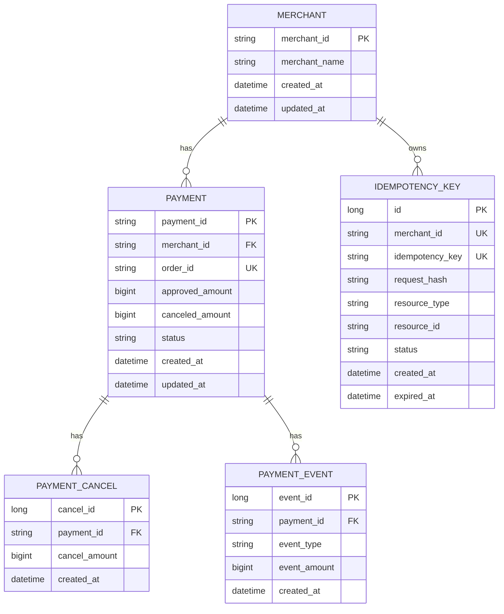

# Payment Platform - 결제 및 취소 시스템

## 제공 기능
- 결제 승인
- 결제 취소(부분 취소, 전체 취소)
- 주문 ID 기반 결제 조회
- 결제 ID 기반 결제 조회
- 가맹점별 결제 목록 조회
- 상태별 결제 목록 조회

## 핵심 설계
- 결제 현재 상태 조회 성능을 위해 `payment`에 현재 상태와 누적 취소 금액을 저장한다.
- 취소 이력 관리를 위해 `payment_cancel`을 분리하고, 승인/취소 이벤트 추적을 위해 `payment_event`를 저장한다.
- `paymentId`를 멱등키로 사용하되, `idempotency_key` 테이블에 요청 해시와 처리 결과 리소스를 저장해 중복 승인 요청을 한 번만 처리한다.
- 동일 결제에 대한 동시 취소 요청은 결제 단위 행 잠금으로 직렬화하고, 트랜잭션 안에서 누적 취소 금액이 승인 금액을 초과하지 않는지 검증한다.
- 결제 상태는 `APPROVED`, `PARTIAL_CANCELED`, `CANCELED`로 관리하며, 누적 취소 금액 기준으로 상태 전이 정합성을 보장한다.

## 1. ERD
merchant
- merchant_id (PK)
- merchant_name
- created_at
- updated_at

payment
- payment_id (PK)
- merchant_id (FK -> merchant.merchant_id)
- order_id
- approved_amount
- canceled_amount
- status (APPROVED / PARTIAL_CANCELED / CANCELED)
- created_at
- updated_at

제약 조건
- UNIQUE (merchant_id, order_id)

인덱스
- INDEX idx_payment_merchant_created_at (merchant_id, created_at)
- INDEX idx_payment_merchant_status_created_at (merchant_id, status, created_at)

payment_cancel
- cancel_id (PK)
- payment_id (FK -> payment.payment_id)
- cancel_amount
- created_at

인덱스
- INDEX idx_payment_cancel_payment_id (payment_id)

payment_event
- event_id (PK)
- payment_id (FK -> payment.payment_id)
- event_type (APPROVED / CANCELED)
- event_amount
- created_at

인덱스
- INDEX idx_payment_event_payment_id_created_at (payment_id, created_at)

idempotency_key
- id (PK)
- merchant_id
- idempotency_key
- request_hash
- resource_type
- resource_id
- status
- created_at
- expired_at

제약 조건
- UNIQUE (merchant_id, idempotency_key)

인덱스
- INDEX idx_idempotency_key_expired_at (expired_at)

## 2. 결제 상태 전이
- `APPROVED`: 결제 승인 완료, 누적 취소 금액 0
- `PARTIAL_CANCELED`: 부분 취소 완료, 0 < 누적 취소 금액 < 승인 금액
- `CANCELED`: 전체 취소 완료, 누적 취소 금액 = 승인 금액

허용 전이
- `APPROVED -> PARTIAL_CANCELED`
- `APPROVED -> CANCELED`
- `PARTIAL_CANCELED -> PARTIAL_CANCELED`
- `PARTIAL_CANCELED -> CANCELED`

